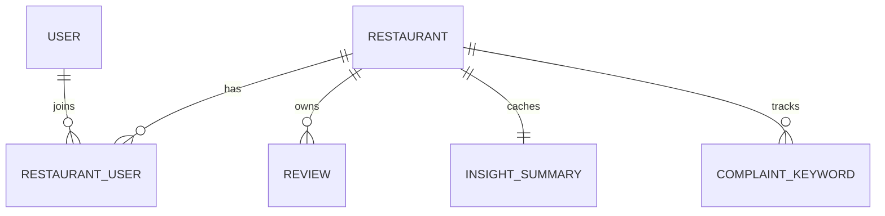

# 4. Database Design - Sprint 1

Date: 2026-03-02  
Updated: 2026-03-07 (Sprint 1 scope sync)
Engine: PostgreSQL + Prisma ORM 7

## 4.1 Data Strategy

- Restaurant-scoped data model
- One user can manage multiple restaurants
- One restaurant can have multiple users
- Sprint 1 creates only the 6 tables needed by the current product loop

## 4.2 Core Entities

| Entity | Purpose |
|--------|---------|
| `User` | Login account |
| `Restaurant` | Restaurant profile + `googleMapUrl` |
| `RestaurantUser` | Membership and permission per restaurant |
| `Review` | Imported Google review + sentiment |
| `InsightSummary` | Cached KPI summary per restaurant |
| `ComplaintKeyword` | Aggregated negative keywords per restaurant |

## 4.3 ER Diagram



## 4.4 Prisma 7 Config

### `prisma.config.ts`

```ts
import 'dotenv/config'
import { defineConfig } from 'prisma/config'

export default defineConfig({
  schema: 'prisma/schema.prisma',
  migrations: {
    path: 'prisma/migrations',
  },
  datasource: {
    url: process.env.DATABASE_URL,
  },
})
```

### `prisma/schema.prisma`

```prisma
generator client {
  provider = "prisma-client-js"
}

datasource db {
  provider = "postgresql"
}

enum RestaurantPermission {
  OWNER
  MANAGER
}

enum ReviewSentiment {
  POSITIVE
  NEUTRAL
  NEGATIVE
}

model User {
  id           String           @id @default(uuid())
  email        String           @unique
  fullName     String
  passwordHash String
  tokenVersion Int              @default(0)
  failedLoginCount Int          @default(0)
  lockedUntil  DateTime?
  lastLoginAt  DateTime?
  createdAt    DateTime         @default(now())
  updatedAt    DateTime         @updatedAt

  restaurants  RestaurantUser[]
}

model Restaurant {
  id            String             @id @default(uuid())
  name          String
  slug          String             @unique
  address       String?
  googleMapUrl  String?
  createdAt     DateTime           @default(now())
  updatedAt     DateTime           @updatedAt

  users         RestaurantUser[]
  reviews       Review[]
  insight       InsightSummary?
  keywords      ComplaintKeyword[]
}

model RestaurantUser {
  id            String               @id @default(uuid())
  userId        String
  restaurantId  String
  permission    RestaurantPermission @default(OWNER)
  createdAt     DateTime             @default(now())

  user          User                 @relation(fields: [userId], references: [id], onDelete: Cascade)
  restaurant    Restaurant           @relation(fields: [restaurantId], references: [id], onDelete: Cascade)

  @@unique([userId, restaurantId])
  @@index([restaurantId])
  @@index([userId])
}

model Review {
  id            String           @id @default(uuid())
  restaurantId  String
  externalId    String
  authorName    String?
  rating        Int
  content       String?
  sentiment     ReviewSentiment?
  reviewDate    DateTime?
  createdAt     DateTime         @default(now())

  restaurant    Restaurant       @relation(fields: [restaurantId], references: [id], onDelete: Cascade)

  @@unique([restaurantId, externalId])
  @@index([restaurantId, rating])
  @@index([restaurantId, reviewDate])
  @@index([restaurantId, sentiment])
}

model InsightSummary {
  id                 String       @id @default(uuid())
  restaurantId       String       @unique
  averageRating      Float        @default(0)
  totalReviews       Int          @default(0)
  positivePercentage Float        @default(0)
  neutralPercentage  Float        @default(0)
  negativePercentage Float        @default(0)
  lastCalculatedAt   DateTime     @default(now())

  restaurant         Restaurant   @relation(fields: [restaurantId], references: [id], onDelete: Cascade)
}

model ComplaintKeyword {
  id            String       @id @default(uuid())
  restaurantId  String
  keyword       String
  count         Int
  percentage    Float        @default(0)
  lastUpdatedAt DateTime     @default(now())

  restaurant    Restaurant   @relation(fields: [restaurantId], references: [id], onDelete: Cascade)

  @@unique([restaurantId, keyword])
  @@index([restaurantId, count])
}
```

## 4.5 Runtime Prisma Client

```js
const { PrismaPg } = require('@prisma/adapter-pg')
const { PrismaClient } = require('@prisma/client')

const adapter = new PrismaPg({
  connectionString: process.env.DATABASE_URL,
})

const prisma = new PrismaClient({ adapter })
```

## 4.6 Why This Schema Fits Sprint 1

- `User.fullName` matches register request data
- `passwordHash` makes the storage intent explicit
- `tokenVersion` lets logout revoke active JWTs without storing every access token
- `failedLoginCount` and `lockedUntil` support temporary account lockout after repeated failures
- `Review.sentiment` supports dashboard percentages and keyword extraction
- `InsightSummary` stores the exact KPI fields the dashboard needs
- `ComplaintKeyword` is pre-aggregated so the complaints widget stays simple
- Composite unique key on `(restaurantId, externalId)` makes import idempotent

## 4.7 Recommended Indexes

| Table | Index | Why |
|-------|-------|-----|
| `Review` | `(restaurantId, externalId)` unique | Duplicate protection |
| `Review` | `(restaurantId, rating)` | Rating filter |
| `Review` | `(restaurantId, reviewDate)` | Date filter + trend |
| `Review` | `(restaurantId, sentiment)` | Sentiment counts |
| `RestaurantUser` | `(userId, restaurantId)` unique | One membership row per restaurant |
| `ComplaintKeyword` | `(restaurantId, keyword)` unique | Upsert aggregated keywords safely |

## 4.8 Not Created In Sprint 1

- `organizations`
- `organization_members`
- `invitations`
- `subscriptions`
- `refresh_tokens`
- `review_batches`
- `review_embeddings`
- `issue_clusters`
- `insight_reports`
- `audit_logs`
